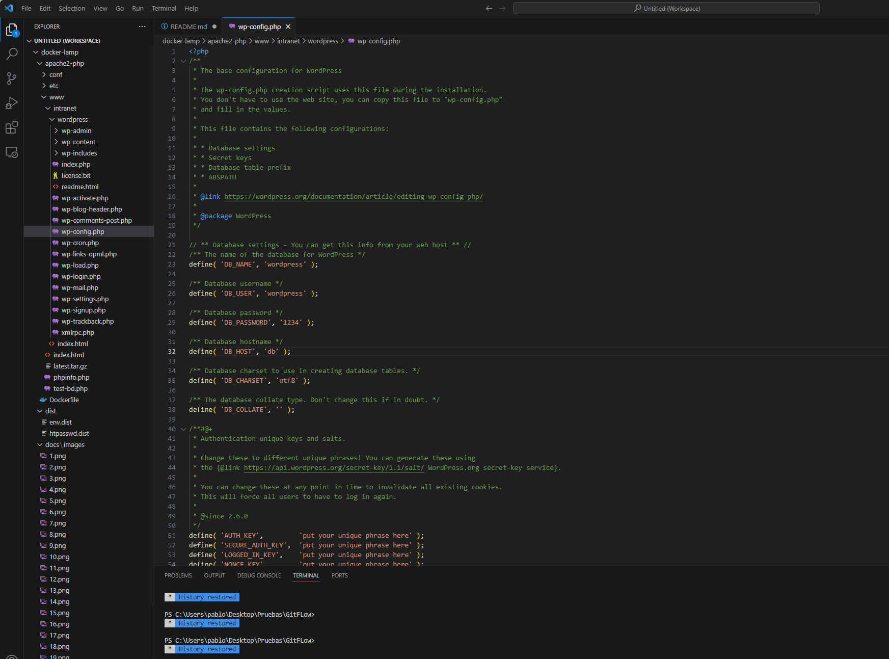

# Configuración de la Pila LAMP en Docker

## Requisitos Previos

Para comenzar con esta configuración, asumimos que ya has completado los pasos para desplegar el servidor web Apache proporcionados por tu profesor. Puedes encontrar instrucciones detalladas en el archivo `readme.md` del repositorio [docker-lamp](https://github.com/antonio-gabriel-gonzalez-casado/docker-lamp/).

## Estructura del proyecto
```
docker-map
├── .gitignore
├── LICENSE
├── README.md
├── docker-compose.yml
├── READMEORIGINAL.md
├── .env
├── apache2-php
│   ├── Dockerfile
│   ├── conf
│   │   ├── 000-default.conf
│   │   ├── intranet.conf
│   │   └── pablo-merinassoto-phpmyadmin.conf
│   ├── etc
│   │   └── apache2
│   │       ├── dummy.txt
│   │       └── .htpasswd
│   └── www
│       ├── index.html
│       ├── phpinfo.php
│       ├── test-bd.php
│       └── intranet
│           └── index.html
├── certs
│   ├── www.key
│   ├── www.crt
│   ├── intranet.key
│   ├── intranet.crt
│   ├── phpmyadmin.key
│   └── phpmyadmin.crt
├── dist
│   ├── env.dist
│   └── htpasswd.dist
└── docs
    └── images

mysql
├── dump
│   └── myDb.sql
└── conf
```

## PARTE 1: Configuración de Virtual Host

### 1. Modificar Nombres de VirtualHost

Modifica los nombres de los VirtualHost de ejemplo de la siguiente manera:

- `www.local` -> `pablo-merinassoto-www.local`
- `intranet.local` -> `pablo-merinassoto-intranet.local`
- `phpmyadmin.local` -> `pablo-merinassoto-phpmyadmin.local`

#### 1.1. Acceder al Archivo de Hosts

Abre el archivo de hosts en tu sistema, que generalmente se encuentra en:

- **Windows:** `C:\Windows\System32\drivers\etc\hosts`
- **Linux/Mac:** `/etc/hosts`

Si estás usando Windows, la ruta sería similar a esta:


#### 1.2. Editar el Archivo de Hosts

Añade las siguientes líneas al final del archivo utilizando un editor de texto, como el Bloc de notas:

```
127.0.0.1    pablo-merinassoto-www.local
127.0.0.1    pablo-merinassoto-intranet.local
127.0.0.1    pablo-merinassoto-phpmyadmin.local
```


Guarda y cierra el archivo.


#### 1.3. Acceder al Archivo de Configuración de Apache

Dirígete al archivo de configuración de las páginas del servidor web Apache en tu proyecto Docker. En nuestra estructura de archivos, se encuentran en:

- **apache2-php/conf/000-default.conf:** para `pablo-merinassoto-www.local`
- **apache2-php/conf/intranet.conf:** para `pablo-merinassoto-intranet.local`
- **apache2-php/conf/pablo-merinassoto-phpmyadmin.conf:** para `phpmyadmin`


### 1.4. Editar el Archivo de Configuración

Para actualizar tu configuración, sigue estos pasos:

1. **Modificar Ajustes de VirtualHost:**
   - Busca las líneas `VirtualHost` en tus archivos de configuración.
   - Cambia los valores de `ServerName` para reflejar los nuevos nombres.

2. **Para `pablo-merinassoto-www.local`:**
   

3. **Para `pablo-merinassoto-intranet.local`:**
   

4. **Levantar Docker-Compose y Comprobar:**
   - Ejecuta `Docker-compose build`
     
   - Ejecuta `Docker-compose up -d`
     

5. **Acceso a los Sitios:**
   - Para `http://pablo-merinassoto-www.local:8080/`
     
   - Para `http://pablo-merinassoto-intranet.local:8060/`, accede con el usuario por defecto `usuario1:123456789`
     


### 2. Creación de Virtual Host para PhpMyAdmin

Para facilitar el acceso a PhpMyAdmin, sigue estos pasos:

1. Crea un archivo de configuración llamado `pablo-merinassoto-phpmyadmin.conf`.

2. Codigo de `pablo-merinassoto-phpmyadmin.conf`:

   

3. Guarda el archivo.

4. Asegúrate de que Docker Compose esté en funcionamiento.

5. Al acceder a `pablo-merinassoto-phpmyadmin.local`, se redirigirá automáticamente a la página de PhpMyAdmin.

   


### 3. Modificación del Index.html de Intranet

Si deseas personalizar la página principal de Intranet, sigue estos pasos:

1. Abre el archivo `index.html` que se encuentra en la siguiente ubicación: `apache2-php/www/intranet/index.html`.

2. Edita este archivo utilizando un editor de texto de tu elección para adaptarlo según tus preferencias y necesidades.

   - En el ejemplo proporcionado, la página principal de Intranet se ha personalizado y modificado de la siguiente manera:

   

3. Guarda los cambios realizados en el archivo `index.html`.

4. Una vez hayas personalizado la página a tu gusto, podrás ver los cambios al acceder a la Intranet a través de tu navegador web.


### 4. Añadir Nuevo Usuario

Si deseas agregar un nuevo usuario con el formato "nombre-apellidos" a la lista de personas que pueden acceder a la intranet, sigue estos pasos:

1. Modifica el archivo donde se almacenan los usuarios y contraseñas, que se encuentra [aquí](apache2-php/etc/apache2/.htpasswd).

2. Para cifrar la contraseña de manera sencilla, puedes utilizar el sitio web [hellotools](https://hellotools.org/es/generar-cifrar-contrasena-para-archivo-htpasswd).

En el ejemplo mostrado, se ha creado un usuario llamado "pablomerinas" con la contraseña cifrada:


3. Una vez hayas realizado estos cambios, reinicia Docker.

4. Ahora puedes acceder a la intranet con el nuevo usuario y su respectiva contraseña:

   
   


## 5. Instalación de CMS WordPress

Para instalar WordPress, sigue estos pasos:

### 5.1. Acceso a phpMyAdmin y Creación de la Base de Datos

Lo primero que debes hacer es acceder al menú de phpMyAdmin utilizando el usuario y contraseña que has configurado. Una vez dentro, sigue estos pasos:

1. Crea una nueva base de datos que será la que utilizarás para WordPress.


2. Luego, crea un usuario. Para hacerlo, ve al menú principal de phpMyAdmin en la sección de "Cuentas de usuarios". Rellena el formulario con un nombre, como "wordpress", elige una contraseña segura y activa la opción para otorgarle todos los privilegios.


3. Ahora, vuelve a la ventana con todos los usuarios y verás que aparece el usuario "wordpress". Edita los privilegios de este usuario.

4. En la parte superior, selecciona "Base de datos" porque configurarás los permisos de este usuario en la base de datos de WordPress.


5. A continuación, verás un menú para asignar permisos sobre esa base de datos, similar a la configuración de permisos globales. Asigna todos los permisos marcando la casilla correspondiente. Con esto, habrás configurado la base de datos en phpMyAdmin.


### 5.2. Descarga y Configuración de WordPress

En tu proyecto, el siguiente paso es descargar WordPress desde la página oficial de [WordPress](https://es.wordpress.org/download/). Una vez descargado, sigue estos pasos:

1. Guarda la carpeta de WordPress en la ubicación `apache2-php/www`, de modo que quede así:


2. Dentro de esta carpeta, modifica el archivo `wp-config-sample.php` y asigna los valores de tu base de datos creada en phpMyAdmin en este archivo de configuración. Deberás configurar el nombre de la base de datos, el usuario, la contraseña y el host. Puedes encontrar el host en la parte superior de phpMyAdmin. Una vez configurado, renombra el archivo a `wp-config.php`.

Ejemplo de configuración:



3. Con la configuración lista, para que se apliquen estas configuraciones, realiza un reinicio de tu Docker Compose con el comando `docker-compose restart`.

### 5.3. Instalación de WordPress

Una vez hecho esto, puedes proceder a la instalación de WordPress siguiendo estos pasos:

1. Utiliza una URL con la estructura `http://example.com/wp-admin/install.php` para acceder a la instalación de WordPress.

2. En tu caso, es posible que debas añadir la ruta `/wordpress` antes de `/wp-admin` ya que normalmente estás ubicado en la carpeta `/www`.

3. Completa los campos con la información que desees, como el título, nombre de usuario, contraseña (que se genera automáticamente pero puedes cambiar), y el correo electrónico. Asegúrate de guardar el nombre de usuario y la contraseña en un lugar seguro.


4. En principio, con la configuración anterior, no debería pedirte esta información de nuevo, pero si es necesario, simplemente completa los datos.

5. Al finalizar, podrás iniciar sesión con el usuario y contraseña que definiste anteriormente.

¡Con esto, habrás instalado WordPress correctamente!


## PARTE 2: Instalación de Certificados SSL

### 1. Generación de Certificados

#### 1.1 Crear Directorio de Certificados
Para empezar, se va a crear una un directorio dentro de apache2-php. Abro un terminal desde apache2-php y creo una carpeta mediante comando y seguidamente nos metemos en esta carpeta que es donde se van a crear los certificados
```
mkdir certs
cd certs
```


#### 1.2 Lanzar el Comando de Generación de Certificados

El comando para la generación de certificados tiene la siguiente estructura:
```
openssl req -x509 -nodes -days 365 -newkey rsa:2048 -keyout nombre-certificado.key -out nombre-certificado.crt
```

Para local se van a llamar www y para intranet se van a llamar intranet, quedando los comandos como:
```
openssl req -x509 -nodes -days 365 -newkey rsa:2048 -keyout www.key -out www.crt
openssl req -x509 -nodes -days 365 -newkey rsa:2048 -keyout intranet.key -out intranet.crt
```

Al ejecutar cada uno de los comandos muestra un pequeño formulario que nos pedira información tal como el pais, estado, organización, correo, entre otras.
Lo que si que es importante es que en el apartado de Common Name se introduzca el nombre del domino, es decir, www.local e intranet.local

En la siguiente imagen muestra la ejecución del comando de creación de certificado, en este caso para crear el certificado de www.local


En la siguiente imagen muestra la ejecución del comando de creación de certificado, en este caso para crear el certificado de intranet.local


La imagen siguiente muestra cómo quedarían los certificados una vez creados.


Adicionalmente se pide realizar el certificado HTTPS para el virtual Host de phpMyAdmin(**pablo-merinassoto-phpmyadmin.local**)
Mis certificados para este virtual host se llamaran phpmyadmin.crt y phpmyadmin.key y se pueden crear con el siguiente comando y presentará una pantalla similar a la de la creación de los anterirores certificados:
```
openssl req -x509 -nodes -days 365 -newkey rsa:2048 -keyout phpmyadmin.key -out phpmyadmin.crt
```


Una vez completado el proceso, los certificados generados para el virtual host de phpMyAdmin se visualizan como se muestra en la imagen siguiente. Estos archivos son esenciales para la configuración segura del servidor.


### 2. Configurar para el protocolo HTTPS

Para cada archivo de configuración, se añade una nueva regla justo después de la que ya estaba especificada. Esta regla verifica el uso del certificado y permite direcciones HTTPS a través del puerto 443:

- [**Para pablo-merinassoto-www.local**](apache2-php/conf/000-default.conf)
  

- [**Para pablo-merinassoto-intranet.local**](apache2-php/conf/intranet.conf)
  

- [**Para pablo-merinassoto-phpmyadmin.local**](apache2-php/conf/pablo-merinassoto-phpmyadmin.conf)
  


### 3. Habilitar Módulo mod_ssl
Primero debemos añadir un par de lineas al DockerFile, la primera una para que lleve los certificados a /etc/apache/ssl
```
COPY ./certs /etc/apache2/ssl
```

La siguiente linea la añadiremos después de la anterior y será la que nos habilitará el módulo ssl:
```
RUN a2enmod ssl
```
Resultado


### 4. Evidencias de ejecución

Al intentar acceder a los enlaces mediante el protocolo HTTP, se muestra un mensaje de error, solicitando el uso del protocolo HTTPS. El ejemplo siguiente muestra este comportamiento para `http://pablo-merinassoto-www.local`:


Para solucionar problemas de carga con HTTPS, se realizaron ajustes como se muestra en la siguiente imagen:


**Evidencias de ejecución HTTPS para pablo-merinassoto-www.local**
Al intentar acceder a la página mediante el protocolo seguro HTTPS (`https://pablo-merinassoto-www.local`), aparece un mensaje de advertencia sobre la conexión no segura, lo cual es esperado ya que los certificados fueron generados manualmente.


Para acceder a la página, se selecciona 'Configuración avanzada' y luego se procede a acceder a la URL:


**Evidencias de los certificados en las 3 secciones**

Las siguientes imágenes muestran los certificados generados para las tres secciones del proyecto:


